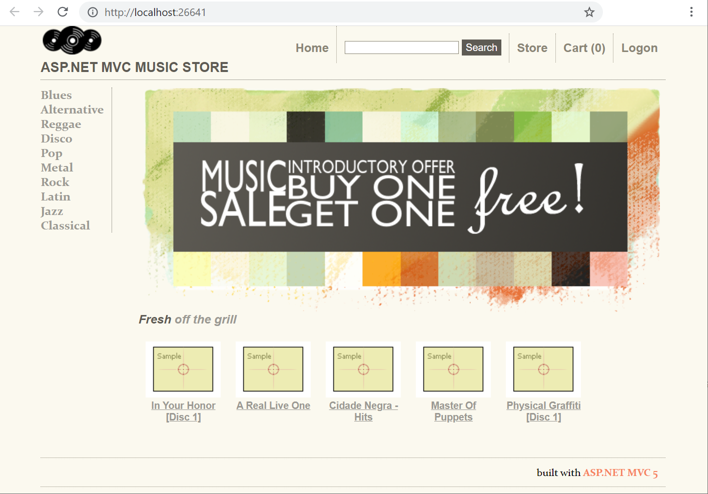

# MvcMusicStore
---
AWS Sample to modernize an old ASP.NET Framework 4.0 MVC e-commerce application.



# License
This library is licensed under the Apache 2.0 License

# Pre-Requisites
1. Visual Studio 2019 16.4 or later with the ASP.NET and web development workload
2. Full .NET Framework 4.0 and 4.8
3. .NET Core 3.1 sdk or later.
4. SQL Server Management Studio
5. MS SQL Server (LocalDB version is perfectly suitable with appropriate connection string adjustments).
6. Git for Windows.

## Checking out source code

In a directory of your choice, please run

```PowerShell
git clone https://github.com/aws-samples/dotnet-modernization-music-store.git
```

## Set up Membership Schema and database to manage Users

* Open Powershell and run the below script. This script will create a SQL Server database named "Identity" on your local machine to manage Users, Roles, and Claims using [Membership Provider](https://docs.microsoft.com/en-us/previous-versions/aspnet/tw292whz(v=vs.100)). (SQL Server is expected to be available at (local) address).

```PowerShell
& $env:WINDIR\Microsoft.Net\Framework\v4.0.30319\aspnet_regsql.exe -S . -d Identity -A all -E
```

## Running locally
Once you have the prerequisites installed on your local development machine you should be able to run the Music Store locally in your IDE. The Music Store uses SQL Server for the backend by default and is seeded with data on startup. You will need to either provision or have access to a database. 


# Store Manager Functionality
Store manager functionality is modernized to use DynamoDB.

Replicate Album,Genre and Artist data using DMS.
1. Create replication job using below JSON for table mapping.
https://gist.github.com/sagulati/626d2a001a55ace7514abe0f866839cb
1. Run the replication job.
1. This should create the AlbumFlat table.


1. Add below two GSI to support following use cases.
    * Get all albums by Genre GUID.
        1. Go to indexes in AlbumFlat table and create new index.
        1. Add GS1PK as Partition Key and GS1SK as Sort Key
        1. Name the index as GS1PK-GS1SK-index
        
    * Get all albums for store management.
        1. Create second indexes in AlbumFlat table.
        1. Add GS2PK as Partition Key and GS2SK as Sort Key
        1. Name the index as GS2PK-GS2SK-index
        
Go to /storemanager and test the functionality.

## Security

See [CONTRIBUTING](CONTRIBUTING.md#security-issue-notifications) for more information.

## License

This project is licensed under the Apache-2.0 License.